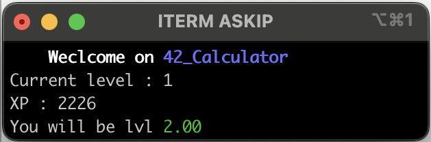

## 42_Calculator

### Description :

#### allows you to calculate your level progression based on an expected amount of XP

### install && run :

```bash
git clone https://github.com/Goschad/42_Calculator.git && cd 42_Calculator && python3 main.py
```

### how to use it :


```txt
Current level : <your_level>
XP : <predicted_xp>
```
